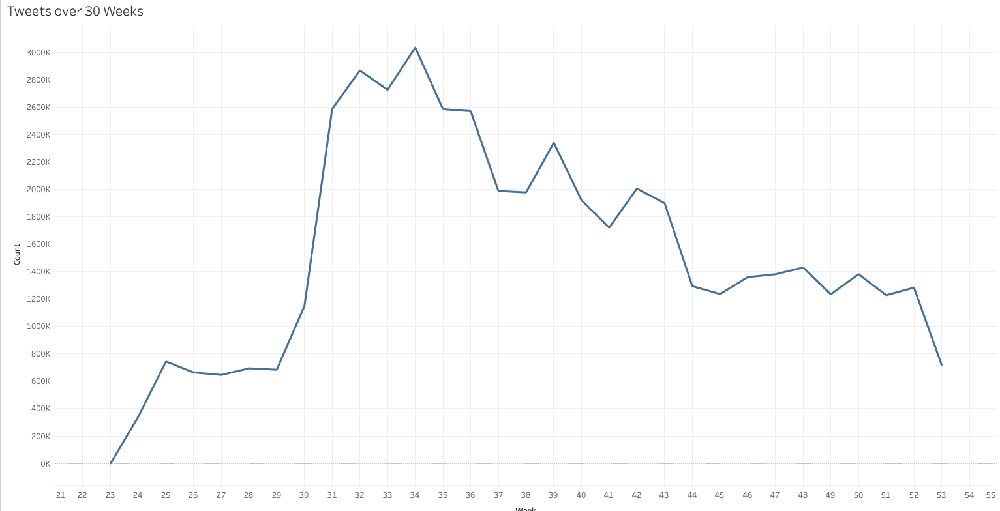

### a) Twitter Analysis with MapReduce

The total count of mobiles outnumbered the total number of desktop in early 2015.
With the data costs getting lower and lower everyday, social network companies have been
benifited the most. One such company is `twiiter`. The micro-blogging site has gained more
traction than any other site.

Twitter stores most of the meta-data of any user using its platform whether be the 
time of tweet or the geo-location.

We'll we walking around with one such dataset. We'll be analyzing the tweets and 
the users involved whether it is the actual user who tweeted or someone mentioned by
another user.

#### Glossary
- [MultilineRecordReader](./src/main/java/edu/usfca/cs/mr/util/MultilineRecordReader.java)
    An extended `RecordReader` that allows reading of 4 lines in a single buffer for mapper.

- [MultiLineFormat](./src/main/java/edu/usfca/cs/mr/util/MultiLineFormat.java) : Provides a new instance of MultilineRecordReader.

- [SentimentAnalysis](./src/main/java/edu/usfca/cs/mr/util/SentimentAnalysis.java) : Calculates the overall sentiment from the list of provided tokens, extracted from text.

#### Compiling the project
- Remember to compile the project, before running jobs
    ```
    mvn compile
    ```
#### 1. Basic Analysis
- a) Finding the Top 5 users that tweeted the most
    
    > [package edu.usfca.cs.mr.top_users](./src/main/java/edu/usfca/cs/mr/top_users)
            
    [TweetUserCountJob.java](./src/main/java/edu/usfca/cs/mr/top_users/TweetUserCountJob.java)        
    [TweetMapper.java](./src/main/java/edu/usfca/cs/mr/top_users/TweetMapper.java)        
    [TweetWritable.java](.src/main/java/edu/usfca/cs/mr/top_users/TweetWritable.java)        
    [TweetCountReducer.java](./src/main/java/edu/usfca/cs/mr/top_users/TweetCountReducer.java)        
    - Usage:
        ```
        <Job.java> <input_file_location> <output_file_location>
        ```
    
    - `Example Output :` Ordered by total number of tweets posted by users in descending order.
    
    Users   | Tweet Metadata
    ```
    burtonator	total tweets=31
                2009-06-02 01:15 | Tweet : No Post Title
                2009-06-02 05:17 | Tweet : No Post Title
                                .
                                .
                2009-06-02 05:17 | Tweet : No Post Title

    managerxing	count=27
                2009-06-11 17:10 | Tweet : #jobs #Manager MGR Med/Surg,Corporate,Brigham City, UT, United States: P STYLE=margin-top:0px;marg.. http://tinyurl.com/n7ds2p
                2009-06-11 17:10 | Tweet : #jobs #Manager HUMAN RESOURCES MANAGER I/II (HUMAN RESOURCES INFORMATION SYSTEMS) (EM-01/EM03),Gov.. http://tinyurl.com/lapp2f
                                .
                                .
                2009-06-11 17:29 | Tweet : 'Lean Management' improve quality and decrease costs, Denver Health is a leader...http://bit.ly/Cvz8W, AHRQ report... http://bit.ly/OlcW8

    ncruralhealth	count=21
                2009-06-11 16:43 | Tweet : No Post Title
                2009-06-10 15:14 | Tweet : No Post Title
                                .
                                .
                2009-06-09 15:15 | Tweet : No Post Title

    stockguy22	count=21
                2009-06-11 15:46 | Tweet : No Post Title
                2009-06-11 15:45 | Tweet : No Post Title
                                .
                                .
    nico_live	count=20
                2009-06-11 17:10 | Tweet : ON AIR START　【茶番師の安価でポン！！！(雑談！！！)】 http://live.nicovideo.jp/watch/lv1418906
                2009-06-11 17:21 | Tweet : ON AIR START　【元・エロ本編集者decのちょっとエロイイ話】 http://live.nicovideo.jp/watch/lv1419107
                                .
                                .
    ```
    - The top 5 users were: 
        - followermonitor, count = 86609
        - delicious50, count = 46282
        - porngus, count = 38658
        - tweet_the_time, count = 38554
        - bildarchiv, count = 35568
        
    - [Complete Output](./output/1%20top_users.txt)
- b) Finding the Top 5 weekly trending tweets
     > [edu.usfca.cs.mr.weekly_trending_tag](./src/main/java/edu/usfca/cs/mr/weekly_trending_tag)
       
    [WeeklyHashtagCountJob.java](./src/main/java/edu/usfca/cs/mr/weekly_trending_tag/WeeklyHashtagCountJob.java)        
    [HashTagMapper.java](./src/main/java/edu/usfca/cs/mr/weekly_trending_tag/HashTagMapper.java)        
    [HashtagWritable.java](.src/main/java/edu/usfca/cs/mr/weekly_trending_tag/HashtagWritable.java)        
    [TagCountReducer.java](./src/main/java/edu/usfca/cs/mr/weekly_trending_tag/TagCountReducer.java)        
    [WeekWritable.java](./src/main/java/edu/usfca/cs/mr/weekly_trending_tag/WeekWritable.java)
    - Usage:
    ```
    <Job.java> <input_file_location> <output_file_location>
    ```
    - `Example Output :` Ordered by count of week-wise top 5 trending tweets in descending order.
    
    ```
    Week 23	count = 1 | Top 5 trending tags for the week
    [
                #redsox, count=1
    ]

    Week 24	count = 21443 | Top 5 trending tags for the week
    [
                #NILEY, count=20, 
                #Nemi, count=19, 
                #dl4sg, count=14, 
                #Pro-niley, count=12, 
                #stopniley, count=12
    ]
    ```
    - [Actual Output](./output/2%20weekly_trending.txt)
    - [CSV for Visualization](./output/2%20weekly_trending.csv)
    
    #### Weekly trends
    

#### c) Sentiment Analysis 
- Job 1 + Job2 in same SentimentAnalysisCountJob file
 - a) Finding the sentiment of tweets for top 5 users that tweeted the most:
    > [edu.usfca.cs.mr.sentiment_analysis](./src/main/java/edu/usfca/cs/mr/sentiment_analysis)
             
    [SentimentAnalysisCountJob.java](./src/main/java/edu/usfca/cs/mr/sentiment_analysis/SentimentAnalysisCountJob.java)        
     [TagSAMapper.java](./src/main/java/edu/usfca/cs/mr/sentiment_analysis/TagSAMapper.java)        
     [TagSAReducer.java](./src/main/java/edu/usfca/cs/mr/sentiment_analysis/TagSAReducer.java)        
     [HashtagSAWritable.java](./src/main/java/edu/usfca/cs/mr/sentiment_analysis/HashtagSAWritable.java)        
     [WeekSAWritable.java](./src/main/java/edu/usfca/cs/mr/sentiment_analysis/WeekSAWritable.java)        
     
     - Usage 
     ```
        <Job.java> <input_file_location> <output_file_location_job1> <output_file_location_job2> <positive_word_file_path> <negative_word_file_path>
     ```
     - `Example Output`

    ```
    Week 23			 Total hashtags 1

        [Tweet : #redsox     count=1				 Overall Sentiment: 0.0				 Users: [redsoxtweets]]

    Week 24			 Total hashtags 2915

        [Tweet : #Nemi     count=19				 Overall Sentiment: 1.32				 Users: [nemislovexo]
        , Tweet : #dl4sg     count=14				 Overall Sentiment: 0.79				 Users: [wastethesewords]
        , Tweet : #skiesflu     count=10				 Overall Sentiment: 1.67				 Users: [syrupandhoney]
        , Tweet : #Niley     count=6				 Overall Sentiment: 8.33				 Users: [xxli]
        , Tweet : #STOPTWITTERJAIL     count=5				 Overall Sentiment: 2.86				 Users: [zeedubb]
    ]
    ```
   - [Actual Output](./output/3b_top_users.txt)

 - b) Finding the sentiment of top 5 weekly trending tweets
   
    > [edu.usfca.cs.mr.sentiment_analysis](./src/main/java/edu/usfca/cs/mr/sentiment_analysis)
            
     [SentimentAnalysisCountJob.java](./src/main/java/edu/usfca/cs/mr/sentiment_analysis/SentimentAnalysisCountJob.java)        
     [UserSAMapper.java](./src/main/java/edu/usfca/cs/mr/sentiment_analysis/UserSAMapper.java)        
     [UserSAReducer.java](./src/main/java/edu/usfca/cs/mr/sentiment_analysis/UserSAReducer.java)        
     [UserSentimentWritable.java](./src/main/java/edu/usfca/cs/mr/sentiment_analysis/UserSentimentWritable.java)
        
    - Usage:
         ```
         <Job.java> <input_file_path> <output_file_path_job_1> <output_file_path_job_2> <output_file_path_job_1> <positive_words_txt_path> <negative_words_txt_path>
         ```
     
     - `Example Output :` Ordered by total number of tweets posted by users in descending order.
        
        ```
        whereonpre			 Total Tweets =36	| Overall sentiment = 1.01% positive
                        Hashtags for the user : [#whereonpre]

        managerxing			 Total Tweets =34	| Overall sentiment = neutral
                            Hashtags for the user : [#Manager, #jobs]

        hashjobs			 Total Tweets =31	| Overall sentiment = neutral
                            Hashtags for the user : [#job, #jobs]

        qaqccrossing			 Total Tweets =29	| Overall sentiment = neutral
                            Hashtags for the user : [#QA, #QAQC, #QC, #jobs]

        rideshare_usa			 Total Tweets =29	| Overall sentiment = 0.57% positive
                            Hashtags for the user : [#DC, #St, #Boston, #Las, #Minneapolis, #Baltimore, #Sacramento, #Rhode, #Miami, #Los, #SF, #Raleigh, #Chicago, #Manhattan, #Portland, #Columbus, #Dallas, #Denver]

        ```
       - [Actual Output](./output/3a_trending_hashtag.txt)

#### c) Advanced Analysis (Sentiments for Popular Users)
 -  Finding the sentiment of top 5 weekly mentioned users/ popular users

    > [edu.usfca.cs.mr.advanced_analysis_1](./src/main/java/edu/usfca/cs/mr/advanced_analysis_1)
            
     [WeeklyPopularUsersJob.java](./src/main/java/edu/usfca/cs/mr/advanced_analysis_1/WeeklyPopularUsersJob.java)
             
     [UsersWritable.java](./src/main/java/edu/usfca/cs/mr/advanced_analysis_1/UsersWritable.java)        
     [WeeklyPopUsersMapper.java](./src/main/java/edu/usfca/cs/mr/advanced_analysis_1/WeeklyPopUsersMapper.java)        
     [WeeklyPopUsersReducer.java](./src/main/java/edu/usfca/cs/mr/advanced_analysis_1/WeeklyPopUsersReducer.java)        
     [WeeklyUsersWritable.java](./src/main/java/edu/usfca/cs/mr/advanced_analysis_1/WeeklyUsersWritable.java)        
     
    - Usage:
         ```
         
         <Job.java> <input_file_location> <output_file_location> <positive_word_file_path> <negative_word_file_path>
         ```
     
     - `Example Output :` Ordered by total number of tweets posted by users in descending order.
     
        ```
            Week 23	, count=13, Users [
                        User : @smokeyozzy, mentioned by 8 people. [caitlinhllywd, annieng, hidexthexkey, denidzo, redsoxtweets, pattib0i, lunatic_xd]
                                    Overall Sentiment : 3.001324693287037E9						 Hashtags used : [#redsox]
                                    mentioned at : [2009-06-07 02:07, 2009-06-07 02:07, 2009-06-07 02:07, 2009-06-07 02:07, 2009-06-07 02:07, 2009-06-07 02:07, 2009-06-07 02:07], 
                        User : @mulatta, mentioned by 1 people. [sideshowkat]
                                    Overall Sentiment : 4.545454545454546						 Hashtags used : []
                                    mentioned at : [2009-06-07 02:07], 
                        User : @fabro84, mentioned by 1 people. [hokiepokie728]
                                    Overall Sentiment : 4.3478260869565215						 Hashtags used : []
                                    mentioned at : [2009-06-07 02:07], 
                        User : @Pensblog, mentioned by 1 people. [scatlett87]
                                    Overall Sentiment : 4.166666666666666						 Hashtags used : []
                                    mentioned at : [2009-06-07 02:07], 
                        User : @muffinbandit13, mentioned by 1 people. [pattib0i]
                                    Overall Sentiment : 10.0						 Hashtags used : []
                                    mentioned at : [2009-06-07 02:07]]
            Week 24	, count=9717, Users [
                        User : @mileycyrus, mentioned by 48 people. [love_isonitsway, beeckyyy, nicholasbuhdd, amdurso, sidish6, gizmothegoat, kryscastillo, naomi_z, disney_dreaming, bylestrange, junethrusept, calleighdelko, livez4music, official_hajare, dexter1977, peruvianhearts2, _krazeee_, jaywater, duhstyee, blakebelch, kitiok, ziggylogan, megandohertyxo, orlaboyle, gianniirivera, kayleenduhh, kssdrama, karinesz, smileyh10, martahgw, shadrack96, wingman103, thacyrus, courtneyy1888, smileyh10, mirandian, yak0ut, jesskristsher, llydiaa, guitargirl13, inesdominguesms, coolaid07, smiley_095, stephen_marquez, mollyoconnor, officialluis, mwuahahaha, gabesok]
                                    Overall Sentiment : 1.2622473341952956E34						 Hashtags used : [#niley, #1, #Niley]
                                    mentioned at : [2009-06-11 17:33, 2009-06-11 17:33, 2009-06-11 17:32, 2009-06-11 17:31, 2009-06-11 17:29, 2009-06-11 17:29, 2009-06-11 17:29, 2009-06-11 17:28, 2009-06-11 17:27, 2009-06-11 17:26, 2009-06-11 17:26, 2009-06-11 17:26, 2009-06-11 17:25, 2009-06-11 17:25, 2009-06-11 17:25, 2009-06-11 17:25, 2009-06-11 17:24, 2009-06-11 17:24, 2009-06-11 17:24, 2009-06-11 17:24, 2009-06-11 17:24, 2009-06-11 17:24, 2009-06-11 17:24, 2009-06-11 17:23, 2009-06-11 17:23, 2009-06-11 17:23, 2009-06-11 17:23, 2009-06-11 17:22, 2009-06-11 17:21, 2009-06-11 17:18, 2009-06-11 17:17, 2009-06-11 17:17, 2009-06-11 17:15, 2009-06-11 17:13, 2009-06-11 17:13, 2009-06-11 17:11, 2009-06-11 17:11, 2009-06-11 17:10, 2009-06-11 17:09, 2009-06-11 17:07, 2009-06-11 17:05, 2009-06-11 17:01, 2009-06-11 17:01, 2009-06-11 17:00, 2009-06-11 16:58, 2009-06-11 16:58, 2009-06-11 16:57, 2009-06-11 16:56], 
                        User : @peterfacinelli, mentioned by 43 people. [ayly301, martinelovely, bevdearden, eyesofamberblog, steffie_28, sunray16, nataliemead, louiselouth, valbarbieri, .
                        .
                        .
                        .
        ```
       - [Actual Output](./output/4%20Advanced1.txt)

#### c) Advanced Analysis (Sentiments for Different Length tweets)
- Finding the sentiment of weekly 150, 200 and 250 character tweets

    > [edu.usfca.cs.mr.advanced_analysis_2](./src/main/java/edu/usfca/cs/mr/advanced_analysis_2)
            
     [WeeklyTweetLenJob.java](./src/main/java/edu/usfca/cs/mr/advanced_analysis_2/WeeklyTweetLenJob.java)              
     
      
   - Usage:
     ```
     <Job.java> <input_file_location> <output_file_location> <positive_word_file_path> <negative_word_file_path>
     ```
     
     - `Example Output :` Ordered by total length of tweets (150, 200, 250).
     
        ```
        Week 23		  Total tweets count 59
        [
            Tweet Length : 150 characters 			 Overall Sentiment : 22.3 % | tweeted by 55 people. Tweet users :[Anonymous, koryelogan, koryelogan, koryelogan, koryelogan, koryelogan, koryelogan, koryelogan, koryelogan, koryelogan, koryelogan, koryelogan, koryelogan,..]
                                                tweeted at : [2009-06-01 21:43, 2009-06-07 20:43, 2009-06-07 19:52, 2009-06-07 18:37, 2009-06-07...]
        , 
            Tweet Length : 200 characters 			 Overall Sentiment : 1.9 % | tweeted by 4 people. Tweet users :[samgovephoto, redsoxtweets, hokiepokie728, cyberplumber]
                                                tweeted at : [2009-06-07 02:07, 2009-06-07 02:07, 2009-06-07 02:07, 2009-06-07 02:07]
        ]

        Week 24		  Total tweets count 602
        [
        Tweet Length : 150 characters 			 Overall Sentiment : 15.12 | tweeted by 507 people. Tweet users :[corns5050, torley, purpleskull1, nbeasley10, mindpowercoach, konechi, hillelaron, ecpersonalfinan, ashleyshae32, alyricz, philwalters, mslanderos, lakota75, coniyac...]
                tweeted at : [2009-06-11 16:57, 2009-06-11 16:57, 2009-06-11 16:57, 2009-06-11 16:57, 2009-06-11 16:57, 2009-06-11 16:57, 2009-06-11 16:57, 2009-06-11 16:57, 2009-06-11 16:57, ...... ]
        , 
        Tweet Length : 200 characters 			 Overall Sentiment : 5.07 | tweeted by 95 people. Tweet users :[bakari45, reyoobs, itsjusttavia, bribri2007, lovejones83, gideon_alsierra, rcc_br, talk_depression, benlord, slashfreak211, mwuahahaha, dfaubla, glutenfreegirl,...]
                                            tweeted at : [2009-06-11 16:57, 2009-06-11 16:57, 2009-06-11 16:57, 2009-06-11 16:57, 2009-06-11 16:57, 2009-06-11 16:57, 2009-06-11 16:57, 2009-06-11 16:57, 2009-06-11 16:57, 2009-06-11 ...]
        ]

        ```

 ---
 
### b) Stack Overflow Log Analysis with MapReduce
#### File Path :`/home/aksrivastava/project2-finalProjectData`
#### Glossary

- [SentimentAnalysis](./src/main/java/edu/usfca/cs/mr/util/SentimentAnalysis.java) : Calculates the overall sentiment from the list of provided tokens, extracted from text.

#### Compiling the project
- Remember to compile the project, before running jobs (if not done for previous section)
    ```
    mvn compile
    ```
####  Analysis
- Finding the Top 5 posts with sentiments
    
    > [edu.usfca.cs.mr.stack_overflow_top5_posts](./src/main/java/edu/usfca/cs/mr/stack_overflow_top5_posts)
            
    [WeeklyPostCountJob.java](./src/main/java/edu/usfca/cs/mr/stack_overflow_top5_posts/WeeklyPostCountJob.java)        
    [TweetMapper.java](./src/main/java/edu/usfca/cs/mr/stack_overflow_top5_posts/TweetMapper.java)        
    [TweetWritable.java](.src/main/java/edu/usfca/cs/mr/stack_overflow_top5_posts/TweetWritable.java)        
    [TweetCountReducer.java](./src/main/java/edu/usfca/cs/mr/stack_overflow_top5_posts/TweetCountReducer.java)        
    - Usage:
        ```
        <Job.java> <input_file_location> <output_file_location> <positive_word_file_path> <negative_word_file_path>
        ```
    
    - `Example Output :` Ordered by total number of tweets posted by users in descending order.

    ```
    Week 8			 Total posts 2
    
                2014-02-18 13:33	Title: How can I set the Software Center to install software for non-root users?
                                    Sentiment: 2.38% positive	Score: 48	Answer Count: 5
    
                2014-02-18 13:34	Title: What are some alternatives to upgrading without using the standard upgrade system?
                                    Sentiment: neutral	Score: 22	Answer Count: 2
    
    
    Week 13			 Total posts 1
    
                2013-03-29 05:00	Title: How do I go back to KDE splash / login after installing XFCE?
                                    Sentiment: 2.85% negative	Score: 18	Answer Count: 4
    
    
    Week 30			 Total posts 1
    
                2014-07-22 19:53	Title: How do I enable automatic updates?
                                    Sentiment: neutral	Score: 142	Answer Count: 5
    
    
    Week 33			 Total posts 1
    
                2010-08-22 02:10	Title: How do I run a successful Ubuntu Hour?
                                    Sentiment: 5.08% positive	Score: 26	Answer Count: 6
    
    
    Week 49			 Total posts 1
    
                2017-12-10 23:38	Title: How to graphically interface with a headless server?
                                    Sentiment: 3.10% positive	Score: 41	Answer Count: 9
    
    
    Week 51			 Total posts 1
    
                2014-12-16 01:47	Title: How to get the Your battery is broken message to go away?
                                    Sentiment: 11.11% negative	Score: 61	Answer Count: 4
    
    
    
    ```

    - [Actual Output](./output/5%20StackOverflow-Posts.txt)
    
    
- Location-wise top 5 Users with Highest Reputation, ordered by highest upvotes
     > [edu.usfca.cs.mr.stack_overflow_highest_rep_users](./src/main/java/edu/usfca/cs/mr/stack_overflow_highest_rep_users)
       
    [HighestRepUserCountJob.java](./src/main/java/edu/usfca/cs/mr/stack_overflow_highest_rep_users/HighestRepUserCountJob.java)        
    [HighestRepUserMapper.java](./src/main/java/edu/usfca/cs/mr/stack_overflow_highest_rep_users/HighestRepUserMapper.java)                
    [HightestRepUserReducer.java](./src/main/java/edu/usfca/cs/mr/stack_overflow_highest_rep_users/HightestRepUserReducer.java)        
    [LocationWritable.java](./src/main/java/edu/usfca/cs/mr/stack_overflow_highest_rep_users/LocationWritable.java)
    - Usage:
        ```
        <Job.java> <input_file_location> <output_file_location>
        ```
    - `Example Output :` Ordered by count of week-wise top 5 trending tweets in descending order.
    ```
    Algeria	Total Users :1
    [
                User : Px	 (since 2010-10-14)	 reputation=0	 upvotes=0	 views=31	 website=http://pixelmed.wordpress.com/]
    
    Argentina	Total Users :13
    [
                User : Ither	 (since 2010-11-30)	 reputation=52	 upvotes=52	 views=23	 website=NA, 
                User : bruno077	 (since 2010-10-03)	 reputation=35	 upvotes=35	 views=46	 website=http://bonamin.org, 
                User : vicmp3	 (since 2010-10-22)	 reputation=31	 upvotes=31	 views=91	 website=NA, 
                User : Axel	 (since 2010-08-04)	 reputation=19	 upvotes=19	 views=47	 website=http://localhost:8084, 
                User : Sebastián	 (since 2011-01-16)	 reputation=14	 upvotes=14	 views=26	 website=NA]
    
    .
    .
    .
    .
    
    Zimbabwe	Total Users :1
    [
                User : coolmac	 (since 2011-05-09)	 reputation=0	 upvotes=0	 views=5	 website=http://www.twitter.com/mukwenhac]
    
    ```
    - [Actual Output](./output/5%20StackOverflow_users.txt)
#### Adarsh code


- `finalProjectAnalysis1` : Analyzing Comments file from stackoverflow data, to find the top 5 postIds, the sentiment associated with these comments, the users who have made these comments, their scores, dates on which these comments are made etc.
	- File Path :`/home/aksrivastava/project2-finalProjectData/comments.xml`
    
    - [Actual Output](./output/5c%20Comments.txt)
    
- `finalProjectAnalysis2` : Analyzing Tags file from stackoverflow data, to find the top 5 tags, the excerptPostId and wikiPostId etc and displaying the data through the Reducer.
	- File Path :`/home/aksrivastava/project2-finalProjectData/tags.xml`
	